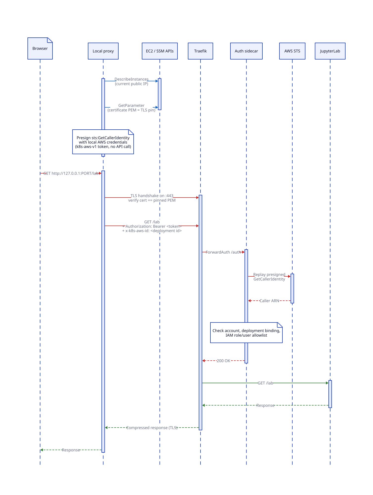
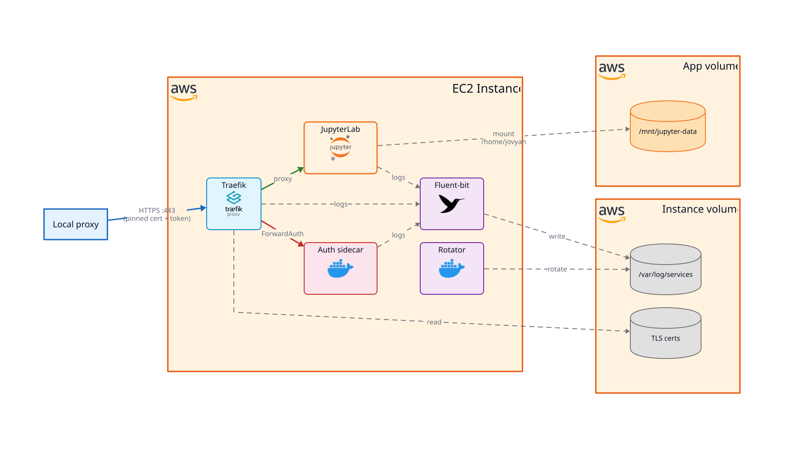

# Architecture

## Data path

The browser never talks to the instance directly. It talks plain HTTP to a local client proxy
bound to a loopback address on your laptop. The proxy forwards each request to the instance's
Traefik on port 443 over TLS, verifying the connection against the instance's pinned self-signed
certificate, and injects a short-lived AWS-identity (STS) token as a request header. Because the
pin is on the certificate rather than the address, a new public IP after an instance stop/start
does not break the connection.

## Certificate pinning

The instance generates a long-lived self-signed TLS certificate at first boot and persists the
private key on the EBS data volume, so the certificate survives instance stop/start cycles. The
instance publishes only the public certificate PEM to an AWS SSM parameter. `jd proxy connect-info`
reads that parameter live and hands the PEM to the client proxy as the pin target. The private key
never leaves the instance, and the certificate value never lands in the terraform state.

## Authentication flow

`jd proxy connect-info` mints a `k8s-aws-v1` token: a presigned `sts:GetCallerIdentity` URL bound
to this deployment's identifier. The proxy attaches the token to every request. On the instance, a
ForwardAuth sidecar behind Traefik validates each token by replaying the presigned call against
AWS STS, checking the deployment binding (the `x-k8s-aws-id` header), verifying the AWS account,
and matching the returned IAM identity against the allowlist of role and user names. Requests with
a valid token from an allowlisted identity reach **JupyterLab**; everything else is rejected. No
shared secret is stored anywhere.

## Containers

The application runs as a set of containerized services orchestrated by Docker Compose.
[Traefik](https://doc.traefik.io/traefik/) terminates TLS on port 443 with the self-signed
certificate and delegates authentication decisions to the auth sidecar via the
[ForwardAuth](https://doc.traefik.io/traefik/reference/routing-configuration/http/middlewares/forwardauth/)
middleware. The auth sidecar is a small Go service that validates the AWS-identity token. Traefik
forwards authenticated requests to the **JupyterLab** container and compresses the responses
(except server-sent event streams, which **JupyterLab** uses for live updates). A **Fluent Bit**
sidecar collects service logs, and a log-rotator container manages log retention on disk.

## Network boundary

The instance's security group allows inbound traffic on port 443 only, open to `0.0.0.0/0`.
The access boundary is the pinned self-signed TLS connection plus the short-lived AWS-identity
token, not the network layer. There is no SSH access; all administrator operations go through
AWS Systems Manager (SSM). SSM handles host and server administration only, never the
**JupyterLab** data path.
