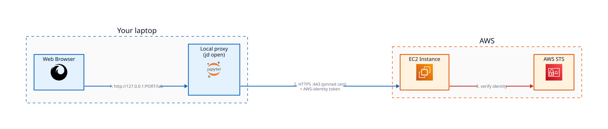

# AWS EC2 JupyterLab Template

The **AWS EC2 JupyterLab Template** deploys a **single-user JupyterLab** application to a dedicated
Amazon EC2 instance, reached from your laptop through a local client proxy over a pinned
self-signed TLS connection, authorized by your AWS identity.

**AWS credentials are the only prerequisite.**

The **AWS EC2 JupyterLab Template** is maintained and supported by AWS.

## 10k View

When you run `jd open`, `jupyter-deploy` starts a local proxy on your laptop and opens your web
browser to a loopback address (for example `http://127.0.0.1:PORT/lab`). Your browser connects to
your app via the local proxy; the proxy forwards each request to the EC2 instance over TLS. The app
authenticates and authorizes each request based on your AWS credentials.



## Next Steps

```{toctree}
:maxdepth: 2

prerequisites
user-guide
architecture
details
```

## License

Licensed under the [MIT License](https://github.com/jupyter-infra/jupyter-deploy/blob/main/libs/jupyter-deploy-tf-aws-ec2-jupyterlab/LICENSE).
